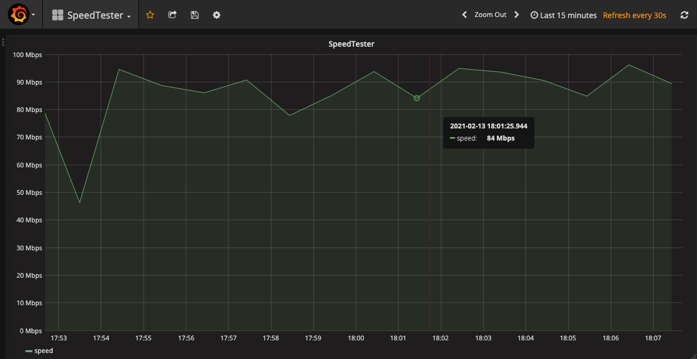

# SpeedTester

SpeedTester is a tool which tests the speed of your internet connection periodically by downloading a file and measuring the elapsed time

SpeedTester can run as a normal command-line application which can be called with ``java -jar SpeedTester.jar``.

The results will be printed to the console and will look like
```
17:47:11.728 [pool-1-thread-1] INFO  n.s.ui.ConsoleResultPrinter - 90,02 MBit/s
17:48:11.686 [pool-1-thread-1] INFO  n.s.ui.ConsoleResultPrinter - 90,73 MBit/s
17:49:11.757 [pool-1-thread-1] INFO  n.s.ui.ConsoleResultPrinter - 89,31 MBit/s
```

Moreover, the results can be sent to an influxDB. Inside `./infra`, you can find a docker compose file which sets up influxDB and Grafana. The dashboard will look like this:

 
## Configuration Parameters
### Mandatory
* `url`: The target file url
### Optional
* `size`: The download size of the file which is used to calculcate your connection speed, in MB
  * default: 50MB
* `interval`: The download interval in minutes
  * default: 1min
* `influx-host`
    * example: `-influx-host http://localhost:8086`
    * hard-coded config:
        * db-name: `influx`
        * measurement: `speed`
        * value: `value`

## Example
``
java -jar SpeedTester.jar -size 20 -interval 1 -url http://www.downloadhost.com/path/to/file.mp4
``

## InfluxDB & Grafana

Based on [DockerGrafanaInfluxKit](https://github.com/BushnevYuri/DockerGrafanaInfluxKit)

* `cd infra && docker-compose up -d`
* visit `http://localhost:3000/` and login with `admin:admin`
* import the dashboard located at `infra/grafana/SpeedTester-dashboard.json`
* select InfluxDB as data source

`docker-compose up -d ` will create a volume where influxDB and Grafana persist data. In order to stop influxDB and Grafana, run `docker-compose down`.
However, this will leave the created volumes. You can remove them by searching them via `docker volume ls` and then remove via `docker volume rm <volume_name>`

## Changelog
### 3.1
* Migrated to java 21
### 3.0
* added support for pushing measurement results to influxDB
* added docker-compose for influxDB and grafana 

## Backlog
* Upgrade or remove Google Guice