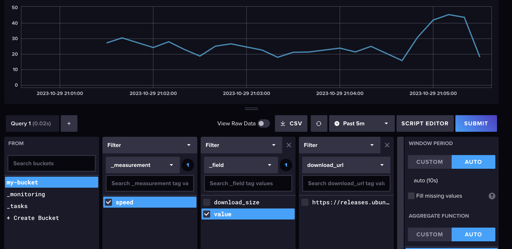

# SpeedTester

SpeedTester is a tool which tests the speed of a network connection periodically by downloading data and measuring the elapsed time.

SpeedTester is available as a
* downloadable jar file (see `./release jars`)
* docker image https://hub.docker.com/r/niklasu/speedtester 

The results are be printed to stdout and look like
```
17:47:11.728 [pool-1-thread-1] INFO  n.s.ui.ConsoleResultPrinter - 90,02 MBit/s
17:48:11.686 [pool-1-thread-1] INFO  n.s.ui.ConsoleResultPrinter - 90,73 MBit/s
17:49:11.757 [pool-1-thread-1] INFO  n.s.ui.ConsoleResultPrinter - 89,31 MBit/s
```

SpeedTester supports InfluxDB as a sink for measurements. The `./infra/docker-compose.yml`, spins up an InfluxDB with an initial setup.

 
## Configuration Parameters

| Parameter       | Description                                                      | Default |
|-----------------|------------------------------------------------------------------|---------|
| `url`           | The target url where the data will be downloaded from            |         |
| `size`          | The amount of Megabytebytes that should be downloaded            | 50      |
| `interval`      | The download interval in seconds (or `0` for single measurement) | 1       | 
| `influx-host`   | URL of the influxDB, e.g. `http://localhost:8086`                |         | 
| `influx-bucket` | Influx bucket e.g. `my-bucket`                                   |         | 
| `influx-token`  | Influx bucket e.g. `my-super-secret-auth-token`                  |         | 
| `influx-org`    | Influx bucket e.g. `my-org`                                      |         | 

## Example
``
java -jar SpeedTester.jar -size 20 -interval 1 -url http://www.downloadhost.com/path/to/file.mp4
``

## Changelog
### 3.6
* Repaired influxdb integration and moved to influxdb2
### 3.5
* Provider docker image
* change unit of interval from minutes to seconds
### 3.4
* Allow interval to be set to 0 which will execute only a single measurement
### 3.3
* added ENV-based config
* removed dependency JCommander
### 3.2
* Replaced Google Guice with Manual Dependency Injection
### 3.1
* Migrated to java 21
### 3.0
* added support for pushing measurement results to influxDB
* added docker-compose for influxDB and grafana 

## Feature backlog
- [x] added ENV-based config
- [x] Upgrade or remove Google Guice
- [x] removed dependency JCommander
- [x] Provide release as docker image
- [x] InfluxDB integration
- [ ] Provide release as k8s job